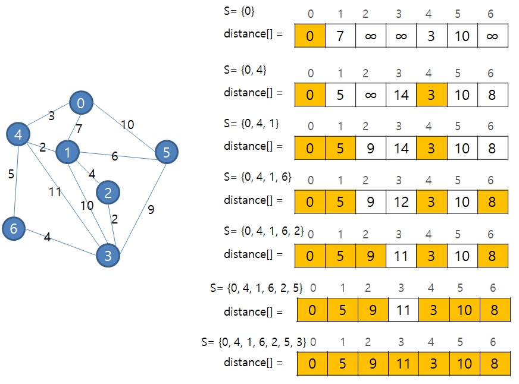

# 최단 경로 알고리즘 - Dijkstra

- 알고리즘
- 2020년 03월 01일

## Why?

[1753번: 최단경로](https://www.acmicpc.net/problem/1753)

> 최단 경로 문제는 네트워크에서 정점 u와 정점 v를 연결하는 경로 중에서 간선들의 가중치 합이 최소가 되는 경로를 찾는 문제다.

## Dijkstra의 최단 경로 알고리즘

네트워크에서 **하나의** 시작 정점으로부터 **모든** 다른 정점까지의 최단 경로를 찾는 알고리즘이다. 최단 경로는 경로의 길이순으로 구해진다.

- 집합 S는 정점 v로부터의 최단 경로가 이미 발견된 정점들의 집합이다.
- distance[]는 시작 정점에서 집합 S에 있는 정점을 거쳐서 다른 정점으로 가는 최단 거리를 기록한 배열이다.
- distance 배열의 초깃값은 시작 정점이 v라면 distance[v] = 0 이고 다른 정점에 대한 distance 값은 v와 해당 정점 간의 가중치가 된다. 정점 v와 w와 직접 간선이 없다면 무한대 값을 저장한다.
- 알고리즘 매 단계에서 집합 S에 없는 정점 중 가장 distance 값이 작은 정점을 S에 추가한다. 왜냐하면 현재 정점 u에서 x, y, z 중 y의 가중치가 최소라면 u → y가 u → x → y 또는 u → y → x 등 어떤 정점을 거쳐서 y로 가든 u → y 가 최단 경로이기 때문이다.
- 새로운 정점 x가 S에 추가되면 S에 있지 않은 다른 정점들의 distance 값을 수정한다. 새로 추가된 정점 x를 거쳐 다른 정점까지 가는 거리와 기존의 거리를 비교하여 더 작은 거리로 distance 값을 수정한다. **distance[w] = min(distance[w], distance[x] + weight[x][w])** 식과 같다.

네트워크에 n개의 정점이 있다면, 다익스트라 최단 경로 알고리즘은 주 반복문을 n번 반복하고 내부 반복문을 2n번 반복하므로 **O(n²)**  의 복잡도를 가진다. distance를 배열이 아닌 **우선순위 큐**를 사용하면 더 빠르게 수행할 수 있다. 

### 백준 문제 풀이

**1753번 최단경로**

[1753번: 최단경로](https://www.acmicpc.net/problem/1753)

    #include <iostream>
    #include <vector>
    #include <queue>
    #define MAX_W 98765432
    using namespace std;
    
    vector<pair<int, int> > graph[20001];
    
    vector<int> dijkstra (int s, int cv) {
    	vector<int> dis(cv, MAX_W);
    	priority_queue<pair<int, int>, vector<pair<int, int> >, greater<pair<int, int> > > pq;
    	pq.push(make_pair(0, s));
    	dis[s] = 0;
    	
    	while (!pq.empty()) {
    		int cost = pq.top().first;
    		int v = pq.top().second;
    		pq.pop();
    		if (dis[v] < cost) continue;
    		
    		for (int i=0; i<graph[v].size(); i++) {
    			if (dis[graph[v][i].second] >= cost + graph[v][i].first) {
    				pq.push(make_pair(cost + graph[v][i].first, graph[v][i].second));
    				dis[graph[v][i].second] = cost + graph[v][i].first;
    			}
    		}
    	}
    	return dis;
    }
    int main() {
    	int v, e, s;
    	int a, b, c;
    	
    	scanf("%d %d", &v, &e);
    	scanf("%d", &s);
    	
    	while (e--) {
    		scanf("%d %d %d", &a, &b, &c);
    		graph[a].push_back(make_pair(c, b));
    	}
    	
    	vector<int> dis = dijkstra(s, v + 1);
    	
    	for (int i=1; i<v+1; i++) {
    		if (dis[i] == MAX_W)
    			printf("INF\n");
    		else
    			printf("%d\n", dis[i]);
    	}
    	
    	return 0;
    }

**참고**

[C언어로 쉽게 풀어쓴 자료구조](http://www.yes24.com/Product/Goods/69750539)