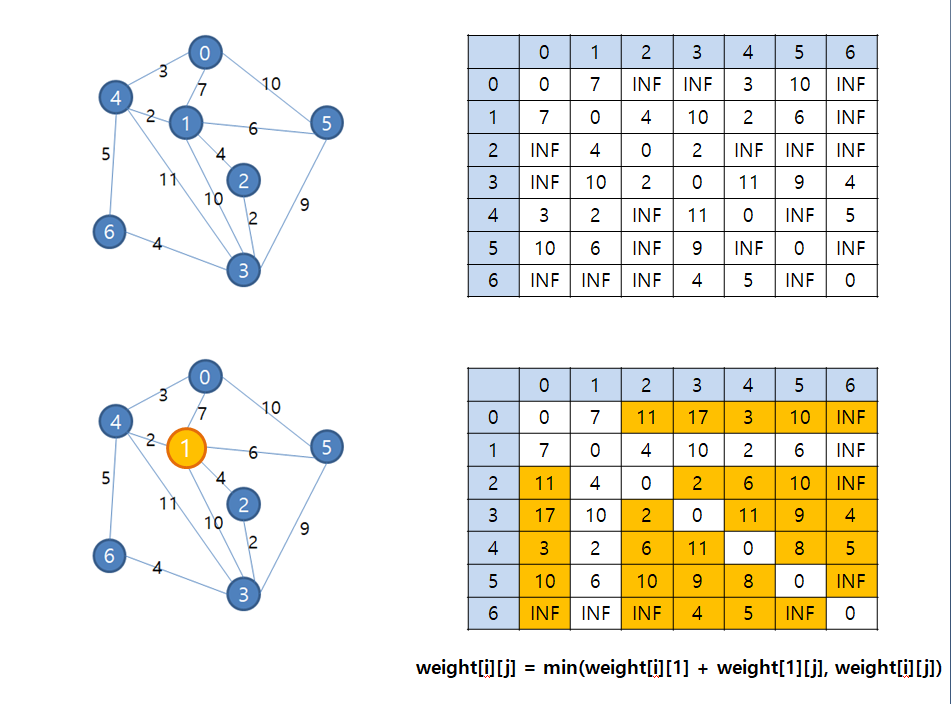

# 최단 경로 알고리즘 - Floyd

- 알고리즘
- 2020년 03월 04일

## Why?

## Floyd 알고리즘

그래프에 존재하는 **모든** 정점 사이의 최단 경로를 한 번에 **모두** 찾아주는 알고리즘이다. 다익스트라는 모든 정점 사이의 최단 경로를 구하려면 정점의 수만큼 다익스트라 알고리즘을 반복 실행한다.

- 2차원 배열 weight를 이용하여 3중 반복으로 구성되어 있다.
- 초기 배열 weight에서 i==j 면 weight[i][j] = 0, i j 사이의 직접 간선 없으면 weight[i][j]=INF, i j 사이 간선 있으면 weight[i][j] = 가중치값
- 정점 0부터 n까지 반복을 돌린다. 정점 0을 거치는 경우..1을 거치는 경우..
- weight[i][j] = min(weight[i][j], weight[i][k] + weight[k][j])

## 백준 문제 풀이

11404번 플로이드

[11404번: 플로이드](https://www.acmicpc.net/problem/11404)

    #include <iostream>
    #include <algorithm>
    using namespace std;
    
    int main() {
    	int n, m;
    	cin >> n >> m;
    	
    	int graph[n+1][n+1];
    	fill(&graph[1][1], &graph[n][n], 10000001);
    	for (int i=1; i<n+1; i++)
    		graph[i][i] = 0;
    		
    	int a, b, c;
    	while (m--) {
    		cin >> a >> b >> c;
    		graph[a][b] = min(graph[a][b], c);
    	}
    	
    	for (int k=1; k<n+1; k++) {
    		for (int i=1; i<n+1; i++) {
    			if (k == i) continue;
    			for (int j=1; j<n+1; j++) {
    				if (k == j) continue;
    				graph[i][j] = min(graph[i][j], graph[i][k] + graph[k][j]);
    			}
    		}
    	}
    	
    	for (int i=1; i<n+1; i++) {
    		for (int j=1; j<n+1; j++) {
    			if (graph[i][j] == 10000001) cout << 0 << " ";
    			else cout << graph[i][j] << " ";
    		}
    			
    		cout << "\n";
    	}
    	
    	return 0;
    }